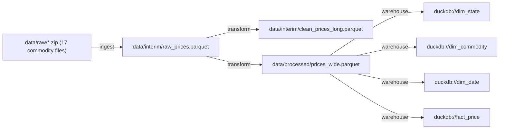

# PolicyLens


**A lineage-tracked data platform that turns 4.27M rows of Indian commodity price
data into a statistically-rigorous, pre-registered policy finding.**

Raw purchased price data → validated cleaning → DuckDB warehouse → OpenLineage
lineage → pre-registered hypothesis testing → an interactive dashboard → a 2-page
policy brief. Every number in the brief traces back to a seeded script.

## The finding

Across 2.05 million state-commodity-day observations (17 essential commodities,
35 Indian states/UTs, 2014–2026), the median retail markup over wholesale price is
**9.30%** [95% CI 9.29%–9.31%] — and that markup **differs significantly by state
in all 17 commodities tested** (Kruskal-Wallis, Benjamini-Hochberg corrected),
even after adjusting for commodity and month. Delhi's adjusted markup runs about
**18.8 percentage points higher than Ladakh's**.

📄 Full brief: [`brief/policy_brief.pdf`](brief/policy_brief.pdf)
📊 Full results: [`RESULTS.md`](RESULTS.md)
📐 Methodology & pre-registration: [`PROBLEM.md`](PROBLEM.md)

<!-- LINEAGE_GRAPH_START -->
## Data Lineage

_Auto-generated by `make lineage` from real OpenLineage events emitted during `make ingest` / `make clean` / warehouse build (`data/interim/lineage_events.jsonl`) -- not hand-drawn._


<!-- LINEAGE_GRAPH_END -->

## Running it

Requires a [Dataful](https://dataful.in) subscription for the raw data (see
[`data/README.md`](data/README.md) for the full provenance chain and why it's
paid, not free). Once `data/raw/` is populated:

```bash
pip install -e ".[dev]"
make ingest      # -> data/interim/raw_prices.parquet
make clean       # -> data/processed/prices_wide.parquet
make warehouse   # -> data/processed/policylens.duckdb
make analysis    # -> reports/results.json, reports/figures/
make brief       # -> brief/policy_brief.pdf
make dashboard   # -> Streamlit app at localhost:8501
```

Or reproduce the whole pipeline with `dvc repro` (verified to give bit-for-bit
identical results and correctly skip already-computed stages). CI runs the same
pipeline against synthetic sample data, since the real data can't be
redistributed — see `scripts/generate_sample_data.py`.

## Architecture

```
data/raw/ (17 purchased datasets, DVC-tracked)
  -> policylens.ingest      typed sources, provenance hashing, pandera schema
  -> policylens.transform   dedup, unit normalization, missing/outlier flagging
  -> policylens.warehouse   DuckDB star schema (dim_state, dim_commodity, dim_date, fact_price)
  -> policylens.lineage     real OpenLineage events -> auto-generated graph (above)
  -> policylens.analysis    EDA, assumption checks, Kruskal-Wallis + BH correction,
                           confounder-adjusted OLS, power analysis, bootstrap robustness
  -> policylens.report      policy brief (markdown -> HTML -> PDF)
  -> dashboard/            Streamlit app (policylens.dashboard)
```

Every stage is a seeded, tested Python module (68 tests) with its own pandera
schema at the ingest/clean boundary — nothing here exists only in a notebook.

## Tech stack

Python · pandas/DuckDB · pandera · statsmodels/scipy · DVC · OpenLineage ·
Streamlit + Plotly · Docker · GitHub Actions

## Data

Dept. of Consumer Affairs, Ministry of Consumer Affairs Food and Public
Distribution, Government of India — daily state-wise wholesale and retail prices
for 17 essential commodities, republished by Dataful (Factly Media & Research).
Full provenance, license, and known caveats: [`data/README.md`](data/README.md).
