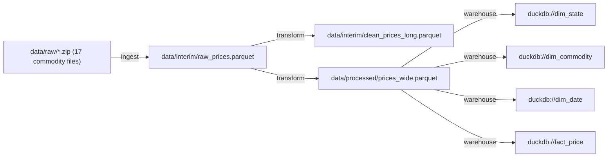

# CivicLens

**An end-to-end, production-grade data platform that turns a messy public dataset into a defensible, statistically-rigorous policy finding.**
CivicLens ingests real-world public-interest data, cleans and tracks lineage, runs a formal statistical analysis, and ships both an interactive dashboard and a short policy brief.

> **Why this project exists (for your profile):** This is your **data-engineering + data-science** proof and the strongest connective tissue for your SOP. It mirrors the actual FDSE job — take an open-ended question and messy data, produce an operational, trustworthy answer — while the statistical analysis layer makes it a legitimate DS portfolio piece and extends your IIT-BHU pricing-audit line of work. It also produces a genuine policy artifact.

<!-- LINEAGE_GRAPH_START -->
## Data Lineage

_Auto-generated by `make lineage` from real OpenLineage events emitted during `make ingest` / `make clean` / warehouse build (`data/interim/lineage_events.jsonl`) -- not hand-drawn._


<!-- LINEAGE_GRAPH_END -->

---

## 1. Pick the dataset first (decide before coding)

Choose **one** with (a) real messiness, (b) a policy question, (c) legal open access:
- **Indian consumer grievances** (National Consumer Helpline / INGRAM open data) — continues your Ministry-of-Consumer-Affairs thread.
- **Ride-hailing / mobility complaints or fare data** — directly extends your pricing-discrimination audit.
- **UAE / Dubai Open Data** (Dubai Pulse) — leverages your local access; strong for regional applications.

**Deliverable of this step:** a one-page `PROBLEM.md` stating the dataset, the single policy question, the unit of analysis, and the hypothesis you will test.

---

## 2. What it does (end-to-end)

```
raw sources ──► ingestion ──► validation ──► cleaning/normalize ──► lineage-tracked warehouse
                                                                          │
                                        ┌─────────────────────────────────┤
                                        ▼                                 ▼
                               statistical analysis                interactive dashboard
                               (hypothesis tests, models)          (explore + drill down)
                                        │
                                        ▼
                                   policy brief (PDF)
```

**Tech stack**
- **Ingestion/transform:** Python 3.11, `pandas` + `polars` (show both — polars for the heavy joins), `pandera` for schema validation, `dlt` or custom loaders.
- **Warehouse:** DuckDB (embedded, fast, portable) as the analytical store; Parquet on disk.
- **Lineage/orchestration:** a lightweight DAG (Prefect **or** a clean `Makefile` + typed pipeline modules); **OpenLineage** events for column-level lineage.
- **Stats/modeling:** `statsmodels`, `scipy.stats`, `pingouin`; `scikit-learn` for any predictive component.
- **Dashboard:** Streamlit (fastest to production) **or** a React + FastAPI split if you want to reuse the SWE stack.
- **Quality/infra:** `pytest`, `great-expectations` or `pandera` checks in CI, Docker, GitHub Actions, `dbt`-style tests optional.

---

## 3. Repo structure

```
civiclens/
├── pyproject.toml
├── README.md
├── PROBLEM.md                 # the question + hypothesis (write first)
├── data/
│   ├── raw/                   # immutable, .gitignored (DVC-tracked)
│   ├── interim/
│   └── processed/
├── src/civiclens/
│   ├── config.py
│   ├── ingest/
│   │   ├── sources.py         # typed source definitions
│   │   └── loaders.py
│   ├── validate/
│   │   └── schemas.py         # pandera schemas per stage
│   ├── transform/
│   │   ├── clean.py
│   │   ├── normalize.py
│   │   └── features.py
│   ├── warehouse/
│   │   └── duck.py            # DuckDB load + query helpers
│   ├── lineage/
│   │   └── emit.py            # OpenLineage events
│   ├── analysis/
│   │   ├── eda.py
│   │   ├── hypothesis.py      # the formal tests
│   │   ├── models.py          # regression / predictive
│   │   └── power.py           # power + effect-size
│   └── report/
│       └── figures.py
├── dashboard/
│   └── app.py                 # Streamlit (or React+FastAPI)
├── notebooks/                 # exploration only; logic lives in src/
├── tests/
├── brief/
│   └── policy_brief.md        # → rendered to PDF
├── dvc.yaml                   # data + pipeline versioning
├── docker/
└── .github/workflows/ci.yml
```

---

## 4. Granular task breakdown

### Phase 0 — Framing & scaffolding
- [ ] Write `PROBLEM.md`: dataset, unit of analysis, one primary hypothesis (H0/H1), pre-registered outcome + covariates.
- [ ] Repo scaffold, `pyproject.toml`, Ruff/mypy/pytest, CI skeleton.
- [ ] Init **DVC**; wire `data/raw` as tracked, `.gitignore` the bytes.
- [ ] Document data provenance + license in `data/README.md`.
- **DoD:** the analysis plan is fixed on paper before you see results (protects against p-hacking — the "bulletproof" standard).

### Phase 1 — Ingestion
- [ ] Define typed `Source` objects (URL/endpoint/file, schema, refresh cadence).
- [ ] Implement loaders (HTTP/CSV/API) with retries + provenance metadata (fetch time, source hash).
- [ ] Land raw → `data/raw` immutably; register in DVC.
- [ ] Unit tests on loaders with fixtures.
- **DoD:** `make ingest` reproducibly lands raw data with a recorded hash.

### Phase 2 — Validation & cleaning
- [ ] Write `pandera` schemas for raw stage; fail loudly on contract violations.
- [ ] Cleaning steps: dedup, type coercion, missing-value strategy (documented, not silent), outlier flagging.
- [ ] Normalization: canonical categories, units, date parsing, geo standardization if relevant.
- [ ] Post-clean `pandera` schema (stricter); assert row-count deltas are explained.
- [ ] Emit a **data-quality report** (nulls, ranges, cardinality) as an artifact.
- [ ] Tests: golden-file on a sampled slice; property tests on invariants.
- **DoD:** every dropped/changed row is attributable to a named rule.

### Phase 3 — Warehouse & lineage
- [ ] Load processed tables into DuckDB; persist as Parquet.
- [ ] Build query helpers + a small star-ish schema (fact + dimensions).
- [ ] Emit OpenLineage events per stage; produce a lineage graph image for the README.
- [ ] Add a `make lineage` target that regenerates the graph.
- **DoD:** you can point to a diagram showing column-level flow source→finding.

### Phase 4 — Statistical analysis (the holistic core)
- [ ] **EDA:** distributions, correlations, group summaries; save figures.
- [ ] **Assumption checks:** normality (Shapiro/QQ), variance homogeneity (Levene), independence; pick tests accordingly.
- [ ] **Primary hypothesis test:** the pre-registered test (e.g. t-test / Mann-Whitney / χ² / ANOVA) with effect size (Cohen's d / Cramér's V / η²).
- [ ] **Multiple-comparison control** where relevant (Bonferroni/Benjamini-Hochberg) — state which and why.
- [ ] **Regression model:** OLS/logistic with the policy-relevant covariates; report coefficients + CIs; check residuals, multicollinearity (VIF).
- [ ] **Confounder handling:** stratification or controls mirroring your pricing-audit method (isolate the effect after route/time/demand-type analogues).
- [ ] **Power / sensitivity analysis:** report achieved power and the minimum detectable effect.
- [ ] **Robustness:** re-run under alternative cleaning choices; bootstrap CIs for the headline number.
- [ ] Wrap every result in a reproducible script (seeded); no result exists only in a notebook.
- **DoD:** each claim in the eventual brief traces to a seeded script and a stated test with an effect size and CI.

### Phase 5 — Dashboard
- [ ] Streamlit app: overview KPIs, distribution explorer, group comparison view, model-results panel.
- [ ] Filters/drill-downs; export-to-CSV of any filtered view.
- [ ] Caching for query performance; loading/empty states.
- [ ] Deploy (Streamlit Community Cloud / Fly.io / a container) with a public link.
- **DoD:** a non-technical reader can reach the headline finding in <3 clicks.

### Phase 6 — Policy brief
- [ ] Draft `policy_brief.md`: problem, method (1 paragraph, honest about limits), finding, effect size in plain language, recommendation.
- [ ] Generate final figures from scripts (not screenshots).
- [ ] Render to a clean PDF (reuse your LaTeX workflow or pandoc).
- [ ] Add an explicit **Limitations** section — sampling, causality caveats, external validity.
- **DoD:** a 2-page brief a policymaker could read in 5 minutes, every number defensible.

### Phase 7 — Reproducibility & release
- [ ] `dvc.yaml` defines the full pipeline; `dvc repro` rebuilds everything from raw.
- [ ] Dockerfile; `make all` runs ingest→analysis→figures end to end in the container.
- [ ] CI runs the pipeline on a sampled dataset + all tests.
- [ ] `RESULTS.md` summary table; tag `v1.0.0`.
- **DoD:** `dvc repro` on a clean clone reproduces the finding bit-for-bit (given cached raw).

---

## 5. Definition of done (whole project)
- One command reproduces raw→brief.
- Pre-registered hypothesis, formal test **with effect size and CI**, and a robustness re-run.
- Public dashboard link + rendered PDF brief with a real Limitations section.
- CI green; lineage graph published.

## 6. Stretch goals
- Causal layer: DiD or propensity-score matching if the data supports it (huge SOP upgrade).
- Schedule a monthly refresh that re-runs the analysis and flags drift.
- Package the cleaned dataset + a datasheet ("Datasheets for Datasets" style) as a citable release.

## 7. Profile coverage this project proves
`Data engineering (ingest/validate/warehouse) · data lineage · statistical inference (tests, effect sizes, power) · regression modeling · confounder control · reproducibility (DVC) · dashboarding · Docker/CI · policy communication`
